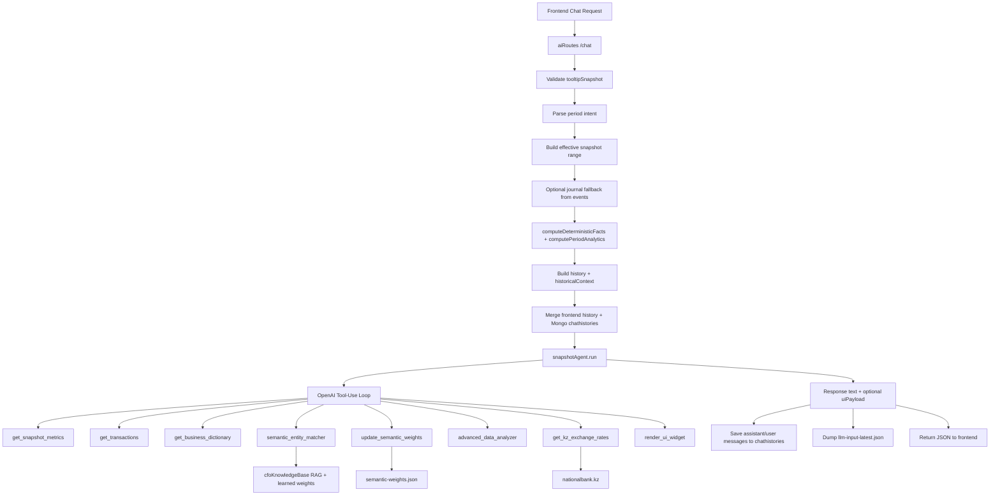

# Snapshot Agent Data Flow

This document describes where the AI agent gets data in `snapshot_llm_chat_tool_use_agent` mode.

## 1) Entry Point

- API route: `POST /api/ai/chat` (alias: `/api/ai/query`)
- Source file: `ai/aiRoutes.js`

Required user payload:

- `message`
- `snapshot` / `tooltipSnapshot` (validated before agent run)

Optional payload:

- `history`
- `currentContext`
- `historicalContext`
- `timelineDate`, `asOf`, `snapshotChecksum`, `isDataChanged`, `source`

## 2) End-to-End Flow

## 3) Data Sources Used By Agent

### A. Frontend snapshot payload

Main source for financial facts in chat mode:

- `snapshot.days[].lists` (income/expense/transfer/withdrawal)
- `snapshot.range`
- `snapshot.visibilityMode`

The route validates and normalizes it before any AI call.

### B. Backend-derived deterministic blocks

Generated before agent invocation:

- `deterministicFacts`
  - totals, balances, ownerDraw, offsetNetting
  - anomalies, topExpenseCategories, largestExpenseCategory
  - operationsMeta
- `periodAnalytics`
  - period totals
  - topOperations
- `history` (previous months)
- `historicalContext` (past/current/future period packets)

These are computed in `aiRoutes` + `snapshotAnswerEngine`.

### C. Journal fallback (Mongo events)

If NLP period is outside UI-selected range, route can rebuild snapshot directly from journal data:

- collection: `events`
- adapter: `quickJournalAdapter`

This guarantees period-specific facts even when UI timeline is narrow.

### D. Chat memory

Merged memory passed to agent:

- frontend `history`
- server `chathistories` (Mongo)

Data-change guard (`snapshotChecksum` / `isDataChanged`) can reset stale context.

### E. Semantic memory and RAG

Used by semantic tools:

- learned alias storage: `ai/debug/semantic-weights.json`
- RAG KB collection: `ai_cfo_knowledge` (Atlas vector search)
- helper: `ai/utils/cfoKnowledgeBase.js`

### F. External source

Used only by `get_kz_exchange_rates` tool:

- `https://nationalbank.kz/rss/rates_all.xml`
- fallback `https://nationalbank.kz/rss/get_rates.cfm?fdate=DD.MM.YYYY`

## 4) What Each Tool Reads

- `get_snapshot_metrics`
  - Reads: `deterministicFacts`, `periodAnalytics`, `historicalContext`
- `get_transactions`
  - Reads: normalized `operations` array in runtime state
- `get_business_dictionary`
  - Reads: entity catalog built from operations + deterministic categories
- `semantic_entity_matcher`
  - Reads: dictionary + RAG hints + learned semantic aliases
- `update_semantic_weights`
  - Writes: learned aliases to `ai/debug/semantic-weights.json`
  - Guard: requires `get_business_dictionary` first
- `advanced_data_analyzer`
  - Reads: transactions and computes via `mathjs`/safe JS eval path
- `get_kz_exchange_rates`
  - Reads: National Bank of Kazakhstan public XML feeds
- `render_ui_widget`
  - Reads: transactions, returns `uiCommand: render_chart` payload

## 5) Runtime State Assembled Inside `snapshotAgent`

Before tool loop, agent builds internal state:

- `currentContext`
- `snapshot`
- `deterministicFacts`
- `periodAnalytics`
- `snapshotMeta`
- `historicalContext`
- `history`
- `comparisonData`
- `operations` (merged from facts + period top ops + snapshot day lists)

This merged `operations` array is the common base for dictionary, transaction filtering, analytics, and chart data.

